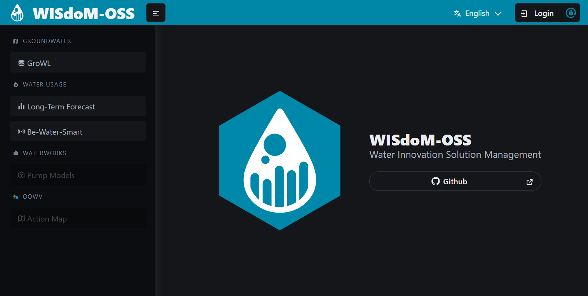

  
  <h1>WISdoM Frontend</h1>
  <h3>frontend</h3>
  

    🗺️ Frontend for the
    <a href="https://github.com/wisdom-oss">WISdoM</a>
    platform.
  

## Overview

This repository contains the **frontend** of the [WISdoM] platform, a
centralized **Water Information System** designed for managing and visualizing
workflows, services, and data in the water industry:

- **WISdoM (Water Innovation Solution Management)[^1]**:
  Focused on developing solutions for the water industry using data science and
  innovation management methods.
  Key areas include customer management and maintenance processes.

- **WISdoM 2.0**[^2]:
  Continues the work of the initial WISdoM project, further exploring data and
  information management, as well as creative laboratory approaches, in
  collaboration with the [Oldenburgisch-Ostfriesischen Wasserverband (OOWV)](OOWV).

The frontend is built with [Angular] and styled using [Bulma], providing users with a modern and intuitive interface.

  

## Live Demo

The `main` branch is hosted at:  
[🔗 wisdom-demo.uni-oldenburg.de](https://wisdom-demo.uni-oldenburg.de)

> [!NOTE]
> A user account in our management system is required for full access, but most
> features are publicly available.

## Contributing

Check out our [CONTRIBUTING](./CONTRIBUTING.md) file for guidelines.

## License

This project is licensed under the terms of the
[European Union Public License (EUPL-1.2)](./LICENSE).

[WISdoM]: https://github.com/wisdom-oss
[OOWV]: https://www.oowv.de
[Angular]: https://angular.dev
[Bulma]: https://bulma.io
[Node]: https://nodejs.org

[^1]: https://uol.de/vlba/projekte/wisdom

[^2]: https://uol.de/vlba/wisdom20
